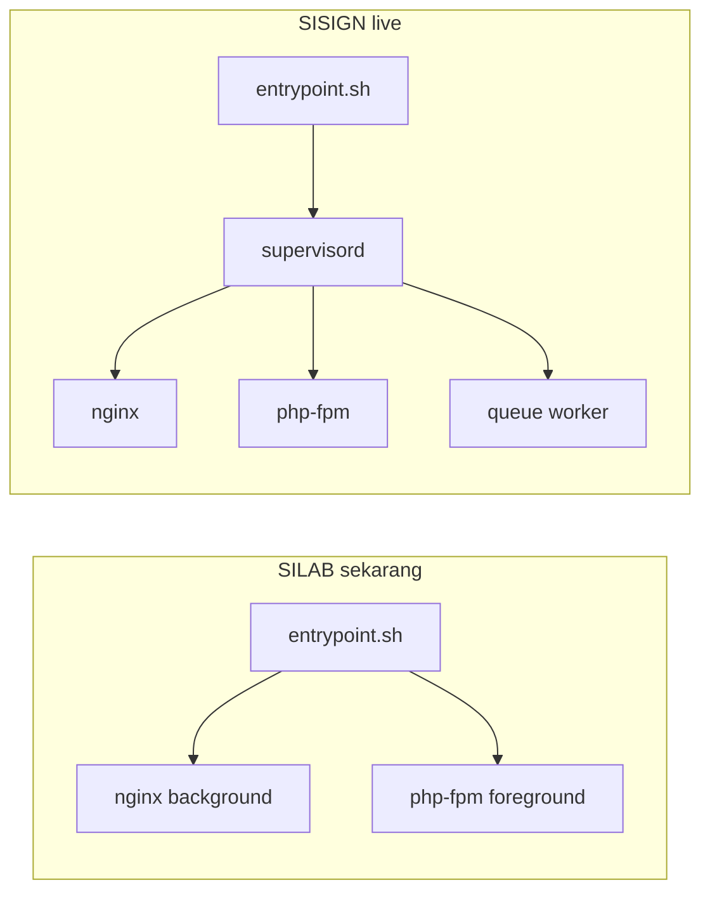

# Audit & Perbaikan Docker SILAB untuk Deploy Unand

## Verdict singkat

**Belum siap 100%.** Arsitektur dasarnya sudah sesuai ketentuan Unand (dan mirip [sisign](https://github.com/Habiboys/sisign.git) yang live), tapi ada **gap kritis di proses start container** yang harus diperbaiki dulu.

| Ketentuan Unand | Status silab | Catatan |
|---|---|---|
| 1 container (App + WebServer) | OK | Nginx + PHP-FPM dalam satu image |
| MySQL bukan container | OK | Tidak ada service MySQL di [`compose.yaml`](compose.yaml); pakai MySQL di host/VM |
| App di-COPY, bukan volume penuh | OK | [`Dockerfile`](Dockerfile) `COPY . .` |
| Volume hanya statis/config | OK | Hanya `./storage` + `./.env` |
| entrypoint + supervisord | **GAGAL** | Tidak ada `supervisord.conf`; entrypoint jalanin nginx/php-fpm manual |
| Dump MySQL di project | OK | Ada [`silabdbnow.sql`](silabdbnow.sql) |
| HTTPS untuk CDN/assets/API | Sebagian OK | CDN sudah `https://`; production HTTPS di-force di AppServiceProvider |
| Struktur folder `app/`, `src/`, `config/` | Tidak sama | **Sisign juga tidak** — tetap lolos live. Ikuti pola sisign (root = app) |

## Perbandingan dengan sisign (referensi live)



**Yang sudah mirip / baik:**
- Satu service di compose, build dari Dockerfile, expose port host `8000`
- Volume terbatas: storage + `.env`
- Nginx config di [`docker/nginx/app.conf`](docker/nginx/app.conf)
- HTTPS production: [`app/Providers/AppServiceProvider.php`](app/Providers/AppServiceProvider.php) set `HTTPS=true` jika `APP_ENV=production`; [`bootstrap/app.php`](bootstrap/app.php) sudah `trustProxies(at: '*')`
- External CDN sudah HTTPS (fonts.bunny, cdnjs, firebase, WAWAY API)

**Gap kritis vs sisign:**

1. **Tidak ada `supervisord.conf`** — Dockerfile menginstall `supervisor` tapi tidak pernah di-copy/dipakai. [`docker-entrypoint.sh`](docker-entrypoint.sh) saat ini:

```12:14:docker-entrypoint.sh
nginx -g 'daemon off;' &

php-fpm
```

   Sisign memakai supervisord (nginx + php-fpm + queue worker) dengan autorestart.

2. **Dockerfile tidak `COPY` supervisord** — sisign punya:
   `COPY docker/supervisord.conf /etc/supervisor/conf.d/supervisord.conf`

3. **Port dalam container beda** — silab: nginx listen `8000`, `EXPOSE 8000`, map `8000:8000`. Sisign: listen `80`, `EXPOSE 80`, map `8000:80` (lebih standar di belakang reverse proxy Unand).

4. **Entrypoint kurang lengkap** — silab `chown` seluruh `/var/www/html` (lambat), tidak `migrate --force`, tidak start via supervisord. Sisign: buat direktori storage, permission terbatas, `storage:link`, `migrate --force`, lalu `exec supervisord`.

5. **Tidak ada `.dockerignore`** — build bisa membawa `.git`, `node_modules`, SQL dump, dll ke image (image besar / risiko).

6. **Nama file compose** — Unand menulis `docker-compose.yml`; proyek memakai `compose.yaml` (Compose v2 menerima keduanya; rename opsional untuk checklist).

7. **Tidak ada `config/php.ini` & `webserver-config.conf` terpisah** — setting PHP sekarang via `fastcgi_param PHP_VALUE` di nginx. Sisign juga begitu; tidak wajib untuk runtime, hanya beda dari template dokumen.

## Pendekatan perbaikan (ikuti sisign)

Tidak merestruktur seluruh Laravel ke folder `app/` (sisign juga tidak). Fokus samakan **runtime Docker yang sudah terbukti live**.

### File yang akan diubah/ditambah

1. **Tambah** [`docker/supervisord.conf`](docker/supervisord.conf) — salin pola sisign (php-fpm, nginx, laravel-worker).
2. **Perbaiki** [`docker-entrypoint.sh`](docker-entrypoint.sh) — mkdir storage, permission, storage:link, migrate, `exec supervisord`.
3. **Perbaiki** [`Dockerfile`](Dockerfile):
   - `COPY docker/supervisord.conf ...`
   - `EXPOSE 80` (bukan 8000)
   - pastikan nginx config listen 80
4. **Perbaiki** [`docker/nginx/app.conf`](docker/nginx/app.conf) — `listen 80;` (hapus/abaikan [`docker/nginx/conf.d/app.conf`](docker/nginx/conf.d/app.conf) yang outdated / root path salah).
5. **Perbaiki** [`compose.yaml`](compose.yaml) — ports `'8000:80'`; pertahankan `image: silab` (membantu tag/push registry) dan `extra_hosts` untuk MySQL di host lokal jika masih dipakai.
6. **Tambah** `.dockerignore` — exclude `.git`, `node_modules`, `vendor`, `storage/logs/*`, `*.sql` (dump tetap di host untuk import MySQL VM, tidak perlu di image), `.env`, dll.
7. **Production `.env` di VM** (bukan di repo): `APP_ENV=production`, `APP_URL=https://...`, `ASSET_URL=https://...`, `DB_HOST` ke IP/hostname MySQL VM Unand.

### Verifikasi lokal sebelum push

```bash
docker compose up -d --build
docker logs silab-app
# buka http://localhost:8000
```

Pastikan di log: supervisord start, nginx + php-fpm running, migrate OK, tidak ada error permission.

### Deploy registry Unand (setelah lokal OK)

```bash
docker tag silab docker-registry.unand.ac.id:8888/silab:v1
docker tag silab docker-registry.unand.ac.id:8888/silab
docker push docker-registry.unand.ac.id:8888/silab:v1
docker push docker-registry.unand.ac.id:8888/silab
```

Di VM: letakkan `silabdbnow.sql` di folder project, import ke `mysql-server` lokal VM, set `.env` DB ke host MySQL tersebut (bukan container).

## Yang tidak perlu diganti besar-besaran

- Tidak memindahkan kode Laravel ke subfolder `app/` ala template Unand (sisign root-level sudah diterima).
- Tidak menambah service MySQL di compose.
- Tidak mem-volume seluruh source code.
