# Analisis Detail Use Case SILAB - Dokumentasi Lengkap

## 1. Daftar Aktor Sistem

| Aktor | Deskripsi |
|:------|:----------|
| **Superadmin** | Administrator sistem dengan akses penuh |
| **Kadep** | Kepala Departemen - Pengawas dengan akses read-only + master data |
| **Admin** | Koordinator Lab - Pengelola operasional (terikat kepengurusan aktif) |
| **Asisten** | Asisten Lab - Staff operasional (terikat kepengurusan aktif) |
| **Praktikan** | Peserta praktikum - Akses terbatas ke tugas dan modul |
| **Dosen** | Dosen pengampu - Pengawas akademik dengan akses read-only |

---

## 2. Diagram Use Case Komprehensif - Semua Modul Terintegrasi

```mermaid
graph TB
    %% ============================================
    %% AKTOR SISTEM
    %% ============================================
    SA[("👑 Superadmin")]
    KD[("📊 Kadep")]
    AD[("🔧 Admin")]
    AS[("👔 Asisten")]
    PR[("🎓 Praktikan")]
    DS[("👨‍🏫 Dosen")]
    
    %% ============================================
    %% MODUL 1: INVENTARIS
    %% ============================================
    subgraph INV["📦 MODUL INVENTARIS"]
        INV_UC1[Lihat Daftar Aset]
        INV_UC2[Tambah Aset Baru]
        INV_UC3[Edit Data Aset]
        INV_UC4[Hapus Aset]
        INV_UC5[Tambah Kategori Aset]
        INV_UC5b[Edit Kategori Aset]
        INV_UC5c[Hapus Kategori Aset]
        INV_UC6[Ajukan Permohonan Pengadaan]
        INV_UC7[Approve Permohonan Pengadaan]
        INV_UC7b[Reject Permohonan Pengadaan]
        INV_UC8[Lihat Daftar Permohonan]
    end
    
    %% ============================================
    %% MODUL 2: KEUANGAN
    %% ============================================
    subgraph FIN["💰 MODUL KEUANGAN"]
        FIN_UC1[Lihat Riwayat Transaksi]
        FIN_UC2[Catat Pemasukan]
        FIN_UC3[Catat Pengeluaran]
        FIN_UC4[Edit Transaksi]
        FIN_UC5[Hapus Transaksi]
        FIN_UC6[Kelola Nominal Kas]
        FIN_UC7[Lihat Rekap Bulanan]
        FIN_UC8[Export Laporan Excel]
        FIN_UC9[Lihat Catatan Kas]
        
        FIN_UC2 -.->|extend| FIN_UC6
        FIN_UC3 -.->|extend| FIN_UC6
        FIN_UC7 -.->|include| FIN_UC1
    end
    
    %% ============================================
    %% MODUL 3: PRAKTIKUM
    %% ============================================
    subgraph PRAK["🔬 MODUL PRAKTIKUM"]
        PRAK_UC1[Buat Praktikum Baru]
        PRAK_UC2[Edit Praktikum]
        PRAK_UC3[Hapus Praktikum]
        PRAK_UC4[Upload Modul/Materi]
        PRAK_UC5[Download Modul]
        PRAK_UC6[Import Praktikan Excel]
        PRAK_UC7[Tambah Praktikan Manual]
        PRAK_UC8[Edit Data Praktikan]
        PRAK_UC9[Assign Kelas]
        PRAK_UC10[Assign Aslab]
        PRAK_UC11[Buat Pertemuan]
        PRAK_UC12[Input Absensi]
        PRAK_UC13[Buat Tugas]
        PRAK_UC14[Submit Tugas]
        PRAK_UC15[Buat Rubrik Penilaian]
        PRAK_UC16[Input Nilai Manual]
        PRAK_UC17[Input Nilai Rubrik]
        PRAK_UC18[Export Nilai]
        PRAK_UC19[Generate Sertifikat]
        
        PRAK_UC1 -.->|include| PRAK_UC10
        PRAK_UC11 -.->|include| PRAK_UC12
        PRAK_UC13 -.->|extend| PRAK_UC15
        PRAK_UC16 -.->|extend| PRAK_UC17
    end
    
    %% ============================================
    %% MODUL 4: KEGIATAN & PROKER
    %% ============================================
    subgraph KEG["🎯 MODUL KEGIATAN"]
        KEG_UC1[Buat Kegiatan Baru]
        KEG_UC2[Edit Kegiatan]
        KEG_UC3[Hapus Kegiatan]
        KEG_UC4[Approve Kegiatan]
        KEG_UC5[Reject Kegiatan]
        KEG_UC6[Upload LPJ]
        KEG_UC7[Tambah Peserta]
        KEG_UC8[Hapus Peserta]
        KEG_UC9[Upload Template Sertifikat]
        KEG_UC10[Generate Sertifikat Kegiatan]
        KEG_UC11[Lihat Kalender Kegiatan]
        
        KEG_UC1 -.->|extend| KEG_UC7
        KEG_UC10 -.->|include| KEG_UC9
    end
    
    subgraph PRO["📋 MODUL PROKER"]
        PRO_UC1[Buat Program Kerja]
        PRO_UC2[Edit Proker]
        PRO_UC3[Hapus Proker]
        PRO_UC4[Upload File Proker]
        PRO_UC5[Update Status Proker]
        PRO_UC6[Lihat Daftar Proker]
        
        KEG_UC1 -.->|include| PRO_UC6
    end
    
    %% ============================================
    %% MODUL 5: PIKET
    %% ============================================
    subgraph PIK["📅 MODUL PIKET"]
        PIK_UC1[Buat Periode Piket]
        PIK_UC2[Buat Jadwal Piket]
        PIK_UC3[Lihat Jadwal Piket]
        PIK_UC4[Request Ganti Jadwal]
        PIK_UC5[Approve Ganti Jadwal]
        PIK_UC6[Reject Ganti Jadwal]
        PIK_UC7[Input Absensi Piket]
        PIK_UC8[Lihat Rekap Absen]
        
        PIK_UC2 -.->|include| PIK_UC1
        PIK_UC5 -.->|extend| PIK_UC6
    end
    
    %% ============================================
    %% MODUL 6: SURAT MENYURAT
    %% ============================================
    subgraph SRT["✉️ MODUL SURAT"]
        SRT_UC1[Kirim Surat]
        SRT_UC2[Lihat Surat Masuk]
        SRT_UC3[Lihat Surat Keluar]
        SRT_UC4[Tandai Dibaca]
        SRT_UC5[Download Lampiran]
        SRT_UC6[Upload Lampiran]
        
        SRT_UC1 -.->|extend| SRT_UC6
    end
    
    %% ============================================
    %% MODUL 7: KEPENGURUSAN
    %% ============================================
    subgraph KPN["👥 MODUL KEPENGURUSAN"]
        KPN_UC1[Lihat Periode Kepengurusan]
        KPN_UC2[Buat Periode Baru]
        KPN_UC3[Set Periode Aktif]
        KPN_UC4[Lihat Anggota]
        KPN_UC5[Tambah Anggota]
        KPN_UC6[Edit Struktur Anggota]
        KPN_UC7[Hapus Anggota]
        KPN_UC8[Transfer dari Periode Lama]
        KPN_UC9[Upload SK Kepengurusan]
        
        KPN_UC2 -.->|extend| KPN_UC9
        KPN_UC5 -.->|extend| KPN_UC8
    end
    
    %% ============================================
    %% MODUL 8: DATA MASTER
    %% ============================================
    subgraph MST["⚙️ MODUL DATA MASTER"]
        MST_UC1[Kelola Struktur Jabatan]
        MST_UC2[Set Default Role Jabatan]
        MST_UC3[Kelola Tahun Kepengurusan]
        MST_UC4[Kelola Data Lab]
        MST_UC5[Kelola Role & Permissions]
        MST_UC6[Struktur Permission Manager]
        MST_UC7[User Management]
        MST_UC8[Tambah User Admin]
        MST_UC9[Edit User]
        MST_UC10[Hapus User]
        
        MST_UC7 -.->|include| MST_UC8
        MST_UC1 -.->|include| MST_UC2
    end
    
    %% ============================================
    %% MODUL 9: SERTIFIKAT
    %% ============================================
    subgraph SERT["🎓 MODUL SERTIFIKAT"]
        SERT_UC1[Lihat Sertifikat Saya]
        SERT_UC2[Download Sertifikat]
        SERT_UC3[Generate Sertifikat Praktikum]
        SERT_UC4[Generate Sertifikat Kegiatan]
        SERT_UC5[Upload Template]
        
        SERT_UC3 -.->|include| SERT_UC5
        SERT_UC4 -.->|include| SERT_UC5
    end
    
    %% ============================================
    %% KONEKSI SUPERADMIN
    %% ============================================
    SA --> INV_UC2
    SA --> INV_UC3
    SA --> INV_UC4
    SA --> INV_UC5
    SA --> INV_UC7
    SA --> FIN_UC2
    SA --> FIN_UC3
    SA --> FIN_UC4
    SA --> FIN_UC5
    SA --> FIN_UC6
    SA --> PRAK_UC1
    SA --> PRAK_UC2
    SA --> PRAK_UC3
    SA --> PRAK_UC4
    SA --> PRAK_UC6
    SA --> PRAK_UC10
    SA --> PRAK_UC15
    SA --> PRAK_UC19
    SA --> KEG_UC4
    SA --> PRO_UC1
    SA --> PRO_UC2
    SA --> PIK_UC1
    SA --> PIK_UC2
    SA --> PIK_UC5
    SA --> KPN_UC2
    SA --> KPN_UC3
    SA --> KPN_UC5
    SA --> MST_UC1
    SA --> MST_UC3
    SA --> MST_UC4
    SA --> MST_UC5
    SA --> MST_UC6
    SA --> MST_UC7
    
    %% ============================================
    %% KONEKSI KADEP
    %% ============================================
    KD --> INV_UC1
    KD --> FIN_UC1
    KD --> FIN_UC7
    KD --> FIN_UC8
    KD --> PRAK_UC5
    KD --> KEG_UC4
    KD --> KEG_UC5
    KD --> KEG_UC11
    KD --> PRO_UC6
    KD --> PIK_UC3
    KD --> PIK_UC8
    KD --> SRT_UC1
    KD --> SRT_UC2
    KD --> SRT_UC3
    KD --> KPN_UC1
    KD --> KPN_UC2
    KD --> KPN_UC3
    KD --> KPN_UC4
    KD --> MST_UC1
    KD --> MST_UC3
    KD --> MST_UC4
    KD --> MST_UC7
    
    %% ============================================
    %% KONEKSI ADMIN
    %% ============================================
    AD --> INV_UC1
    AD --> INV_UC2
    AD --> INV_UC3
    AD --> INV_UC4
    AD --> INV_UC5
    AD --> INV_UC6
    AD --> INV_UC7
    AD --> FIN_UC1
    AD --> FIN_UC2
    AD --> FIN_UC3
    AD --> FIN_UC4
    AD --> FIN_UC5
    AD --> FIN_UC6
    AD --> FIN_UC7
    AD --> PRAK_UC1
    AD --> PRAK_UC2
    AD --> PRAK_UC3
    AD --> PRAK_UC4
    AD --> PRAK_UC5
    AD --> PRAK_UC6
    AD --> PRAK_UC7
    AD --> PRAK_UC8
    AD --> PRAK_UC9
    AD --> PRAK_UC10
    AD --> PRAK_UC11
    AD --> PRAK_UC12
    AD --> PRAK_UC13
    AD --> PRAK_UC15
    AD --> PRAK_UC16
    AD --> PRAK_UC17
    AD --> PRAK_UC18
    AD --> PRAK_UC19
    AD --> KEG_UC1
    AD --> KEG_UC2
    AD --> KEG_UC3
    AD --> KEG_UC4
    AD --> KEG_UC6
    AD --> KEG_UC7
    AD --> KEG_UC9
    AD --> KEG_UC10
    AD --> PRO_UC1
    AD --> PRO_UC2
    AD --> PRO_UC4
    AD --> PRO_UC5
    AD --> PRO_UC6
    AD --> PIK_UC1
    AD --> PIK_UC2
    AD --> PIK_UC3
    AD --> PIK_UC4
    AD --> PIK_UC5
    AD --> PIK_UC8
    AD --> KPN_UC1
    AD --> KPN_UC4
    AD --> KPN_UC5
    AD --> KPN_UC6
    AD --> KPN_UC7
    AD --> SERT_UC3
    
    %% ============================================
    %% KONEKSI ASISTEN
    %% ============================================
    AS --> INV_UC1
    AS --> INV_UC6
    AS --> FIN_UC1
    AS --> FIN_UC7
    AS --> PRAK_UC5
    AS --> PRAK_UC12
    AS --> PRAK_UC13
    AS --> PRAK_UC16
    AS --> PRAK_UC17
    AS --> KEG_UC1
    AS --> KEG_UC2
    AS --> KEG_UC6
    AS --> KEG_UC7
    AS --> KEG_UC11
    AS --> PRO_UC6
    AS --> PIK_UC3
    AS --> PIK_UC4
    AS --> PIK_UC7
    AS --> SRT_UC1
    AS --> SRT_UC2
    AS --> SRT_UC3
    AS --> SRT_UC4
    AS --> SRT_UC5
    AS --> KPN_UC1
    AS --> KPN_UC4
    
    %% ============================================
    %% KONEKSI PRAKTIKAN
    %% ============================================
    PR --> PRAK_UC5
    PR --> PRAK_UC14
    PR --> SERT_UC1
    PR --> SERT_UC2
    
    %% ============================================
    %% KONEKSI DOSEN
    %% ============================================
    DS --> KEG_UC4
    DS --> KEG_UC5
    DS --> KEG_UC11
    DS --> PRO_UC6
    
    %% ============================================
    %% STYLING
    %% ============================================
    style SA fill:#ff6b6b,stroke:#c92a2a,stroke-width:3px,color:#fff
    style KD fill:#4ecdc4,stroke:#0a8071,stroke-width:3px,color:#fff
    style AD fill:#45b7d1,stroke:#1098ad,stroke-width:3px,color:#fff
    style AS fill:#95e1d3,stroke:#38ada9,stroke-width:3px,color:#fff
    style PR fill:#f9ca24,stroke:#f0932b,stroke-width:3px,color:#000
    style DS fill:#a29bfe,stroke:#6c5ce7,stroke-width:3px,color:#fff
    
    style INV fill:#ffeaa7,stroke:#fdcb6e,stroke-width:2px
    style FIN fill:#dfe6e9,stroke:#b2bec3,stroke-width:2px
    style PRAK fill:#74b9ff,stroke:#0984e3,stroke-width:2px
    style KEG fill:#a29bfe,stroke:#6c5ce7,stroke-width:2px
    style PRO fill:#fd79a8,stroke:#e84393,stroke-width:2px
    style PIK fill:#55efc4,stroke:#00b894,stroke-width:2px
    style SRT fill:#fab1a0,stroke:#e17055,stroke-width:2px
    style KPN fill:#81ecec,stroke:#00cec9,stroke-width:2px
    style MST fill:#636e72,stroke:#2d3436,stroke-width:2px,color:#fff
    style SERT fill:#fdcb6e,stroke:#e17055,stroke-width:2px
```

---

## 3. Analisis Use Case Per Modul

### MODUL 1: INVENTARIS (Manajemen Aset)

#### Tabel Detail Aksi

| Use Case | Admin | Asisten | Kadep | Permission | Keterangan |
|:---------|:-----:|:-------:|:-----:|:-----------|:-----------|
| **Lihat Daftar Aset** | ✅ | ✅ | ✅ | `inventaris.view` | Melihat semua item inventaris di lab |
| **Tambah Aset Baru** | ✅ | ❌ | ❌ | `inventaris.manage-items` | Input kode barang, keadaan, status, foto |
| **Edit Data Aset** | ✅ | ❌ | ❌ | `inventaris.manage-items` | Update kode barang, keadaan, status, foto |
| **Hapus Aset** | ✅ | ❌ | ❌ | `inventaris.manage-items` | Hapus aset beserta file foto dari storage |
| **Tambah Kategori Aset** | ✅ | ❌ | ❌ | `inventaris.manage-kategori` | Buat kategori baru (Alat Lab, Bahan Kimia, dll) |
| **Edit Kategori Aset** | ✅ | ❌ | ❌ | `inventaris.manage-kategori` | Update nama kategori |
| **Hapus Kategori Aset** | ✅ | ❌ | ❌ | `inventaris.manage-kategori` | Hapus kategori (jika tidak ada aset terkait) |
| **Ajukan Permohonan Pengadaan** | ✅ | ✅ | ❌ | `inventaris.manage-permohonan` | Request pengadaan aset baru + wishlist barang |
| **Approve Permohonan Pengadaan** | ✅ | ❌ | ❌ | `inventaris.approve-permohonan` | Menyetujui permohonan dengan catatan |
| **Reject Permohonan Pengadaan** | ✅ | ❌ | ❌ | `inventaris.approve-permohonan` | Menolak permohonan dengan alasan |
| **Lihat Daftar Permohonan** | ✅ | ✅ | ❌ | `inventaris.view` | Lihat semua permohonan (pending/approved/rejected) |

---

### MODUL 2: KEUANGAN

#### Tabel Detail Aksi

| Use Case | Admin | Asisten | Kadep | Permission | Keterangan |
|:---------|:-----:|:-------:|:-----:|:-----------|:-----------|
| **Lihat Riwayat Transaksi** | ✅ | ✅ | ✅ | `keuangan.view` | Melihat semua transaksi in/out |
| **Catat Pemasukan** | ✅ | ❌ | ❌ | `keuangan.create-transaksi` + `active.kepengurusan` | Input data uang masuk (dari, nominal, metode pembayaran) |
| **Catat Pengeluaran** | ✅ | ❌ | ❌ | `keuangan.create-transaksi` + `active.kepengurusan` | Input data uang keluar (untuk apa, nominal, bukti) |
| **Edit Transaksi** | ✅ | ❌ | ❌ | `keuangan.update-transaksi` + `active.kepengurusan` | Koreksi data transaksi |
| **Hapus Transaksi** | ✅ | ❌ | ❌ | `keuangan.delete-transaksi` + `active.kepengurusan` | Batalkan/hapus transaksi salah input |
| **Lihat Rekap Bulanan** | ✅ | ✅ | ✅ | `keuangan.view` | Dashboard summary per bulan |
| **Kelola Nominal Kas** | ✅ | ❌ | ❌ | `keuangan.create-transaksi` + `active.kepengurusan` | Set/update batas kas periode |
| **Export Laporan** | ✅ | ❌ | ✅ | `keuangan.view` | Download Excel/PDF rekap keuangan |
| **Lihat Catatan Kas** | ✅ | ✅ | ✅ | `keuangan.view` | Melihat buku kas harian |

---

### MODUL 3: PRAKTIKUM (Inti Akademik)

#### Tabel Detail Aksi

| Use Case | Admin | Asisten | Praktikan | Permission | Keterangan |
|:---------|:-----:|:-------:|:---------:|:-----------|:-----------|
| **Buat Praktikum Baru** | ✅ | ❌ | ❌ | `praktikum.create` + `active.kepengurusan` | Buat mata praktikum (nama, semester, SKS) |
| **Edit Praktikum** | ✅ | ❌ | ❌ | `praktikum.update` + `active.kepengurusan` | Update info praktikum |
| **Hapus Praktikum** | ✅ | ❌ | ❌ | `praktikum.delete` + `active.kepengurusan` | Hapus praktikum beserta data terkait |
| **Upload Modul** | ✅ | ❌ | ❌ | `modul.create` + `active.kepengurusan` | Upload file PDF/ZIP materi |
| **Download Modul** | ✅ | ✅ | ✅ | `modul.view` | Akses materi praktikum |
| **Import Praktikan** | ✅ | ❌ | ❌ | `praktikan.import` + `active.kepengurusan` | Upload Excel data mahasiswa |
| **Tambah Praktikan Manual** | ✅ | ❌ | ❌ | `praktikan.create` + `active.kepengurusan` | Input data praktikan satu-satu |
| **Edit Data Praktikan** | ✅ | ❌ | ❌ | `praktikan.update` + `active.kepengurusan` | Update info praktikan |
| **Assign Kelas** | ✅ | ❌ | ❌ | `praktikan.update` + `active.kepengurusan` | Masukkan praktikan ke kelas tertentu |
| **Assign Aslab** | ✅ | ❌ | ❌ | `praktikum.assign-aslab` + `active.kepengurusan` | Tunjuk asisten untuk praktikum |
| **Buat Pertemuan** | ✅ | ❌ | ❌ | `praktikum.create` + `active.kepengurusan` | Buat jadwal pertemuan (Pertemuan 1, 2, dst) |
| **Input Absensi** | ✅ | ✅ | ❌ | `absensi.create` | Isi kehadiran praktikan per pertemuan |
| **Buat Tugas** | ✅ | ✅ | ❌ | `tugas.create` + `active.kepengurusan` | Buat assignment (judul, deadline, deskripsi) |
| **Submit Tugas** | ❌ | ❌ | ✅ | `tugas.submit` | Upload file jawaban tugas |
| **Buat Rubrik** | ✅ | ❌ | ❌ | `rubrik.create` + `active.kepengurusan` | Definisi komponen penilaian + bobot |
| **Input Nilai Manual** | ✅ | ✅ | ❌ | `tugas.grade` | Beri nilai langsung ke tugas |
| **Input Nilai Rubrik** | ✅ | ✅ | ❌ | `rubrik.grade` | Input nilai per komponen rubrik |
| **Export Nilai** | ✅ | ❌ | ❌ | `tugas.grade` | Download nilai dalam Excel |
| **Generate Sertifikat** | ✅ | ❌ | ❌ | `sertifikat.generate` + `active.kepengurusan` | Auto-generate sertifikat untuk praktikan lulus |

---

### MODUL 4: KEGIATAN & PROKER

#### Tabel Detail Aksi - Kegiatan

| Use Case | Admin | Asisten | Dosen/Kalab | Permission | Keterangan |
|:---------|:-----:|:-------:|:-----------:|:-----------|:-----------|
| **Buat Kegiatan** | ✅ | ✅ | ❌ | `kegiatan.create` | Ajukan kegiatan baru (nama, tanggal, proker terkait) |
| **Edit Kegiatan** | ✅ | ✅ | ❌ | `kegiatan.edit` | Update detail kegiatan (sebelum disetujui) |
| **Hapus Kegiatan** | ✅ | ✅ | ❌ | `kegiatan.delete` | Batalkan kegiatan |
| **Approve Kegiatan** | ✅ | ❌ | ✅ | `kegiatan.approve` | Setujui usulan kegiatan |
| **Reject Kegiatan** | ✅ | ❌ | ✅ | `kegiatan.approve` | Tolak usulan kegiatan |
| **Upload LPJ** | ✅ | ✅ | ❌ | `kegiatan.create` (logic) | Upload Laporan Pertanggungjawaban |
| **Tambah Peserta** | ✅ | ✅ | ❌ | `kegiatan.edit` | Tambah peserta & panitia |
| **Hapus Peserta** | ✅ | ✅ | ❌ | `kegiatan.edit` | Remove peserta dari kegiatan |
| **Upload Template Sertifikat** | ✅ | ❌ | ❌ | `kegiatan.edit` | Upload .docx template |
| **Generate Sertifikat Kegiatan** | ✅ | ❌ | ❌ | `kegiatan.edit` | Auto-fill data ke template |
| **Lihat Kalender Kegiatan** | ✅ | ✅ | ✅ | `kegiatan.view` | Visualisasi kalender semua kegiatan |

#### Tabel Detail Aksi - Proker

| Use Case | Admin | Asisten | Kadep | Permission | Keterangan |
|:---------|:-----:|:-------:|:-----:|:-----------|:-----------|
| **Buat Proker** | ✅ | ❌ | ❌ | `proker.create` + `active.kepengurusan` | Buat program kerja tahunan |
| **Edit Proker** | ✅ | ❌ | ❌ | `proker.update` + `active.kepengurusan` | Update detail/status proker |
| **Hapus Proker** | ✅ | ❌ | ❌ | `proker.delete` + `active.kepengurusan` | Hapus program kerja |
| **Upload File Proker** | ✅ | ❌ | ❌ | `proker.update` + `active.kepengurusan` | Upload dokumen proker (PDF) |
| **Update Status Proker** | ✅ | ❌ | ❌ | `proker.update` + `active.kepengurusan` | Ubah status (belum mulai/berjalan/selesai) |
| **Lihat Proker** | ✅ | ✅ | ✅ | `proker.view` | Melihat semua program kerja |

---

### MODUL 5: PIKET

#### Tabel Detail Aksi

| Use Case | Admin | Asisten | Kadep | Permission | Keterangan |
|:---------|:-----:|:-------:|:-----:|:-----------|:-----------|
| **Buat Periode Piket** | ✅ | ❌ | ❌ | `piket.manage-periode` + `active.kepengurusan` | Set periode piket (Sep-Jan, Feb-Jun) |
| **Buat Jadwal Piket** | ✅ | ❌ | ❌ | `piket.manage-jadwal` + `active.kepengurusan` | Assign asisten ke slot jadwal |
| **Lihat Jadwal Piket** | ✅ | ✅ | ✅ | `piket.view-jadwal` | Melihat siapa piket kapan |
| **Request Ganti Jadwal** | ✅ | ✅ | ❌ | `piket.request-ganti-jadwal` | Ajukan tukar piket dengan alasan |
| **Approve Ganti Jadwal** | ✅ | ❌ | ❌ | `piket.approve-ganti-jadwal` + `active.kepengurusan` | Setujui request |
| **Reject Ganti Jadwal** | ✅ | ❌ | ❌ | `piket.approve-ganti-jadwal` + `active.kepengurusan` | Tolak request |
| **Input Absensi Piket** | ❌ | ✅ | ❌ | `piket.view-jadwal` (custom logic) | Asisten absen saat giliran piket |
| **Lihat Rekap Absen** | ✅ | ❌ | ✅ | `piket.view-jadwal` | Summary kehadiran piket |

---

### MODUL 6: SURAT MENYURAT

#### Tabel Detail Aksi

| Use Case | Admin | Asisten | Kadep | Permission | Keterangan |
|:---------|:-----:|:-------:|:-----:|:-----------|:-----------|
| **Kirim Surat** | ❌* | ✅ | ✅ | `surat.create` | Kirim surat ke lab lain |
| **Lihat Surat Masuk** | ❌* | ✅ | ✅ | `surat.view` | Inbox surat dari lab lain |
| **Lihat Surat Keluar** | ❌* | ✅ | ✅ | `surat.view` | Sent items |
| **Tandai Dibaca** | ❌* | ✅ | ✅ | `surat.view` | Mark as read |
| **Download Lampiran** | ❌* | ✅ | ✅ | `surat.view` | Download file surat |
| **Upload Lampiran** | ❌* | ✅ | ✅ | `surat.create` | Attach file saat kirim surat |

> **Catatan**: *Admin memiliki permission backend (`surat.*`) tapi menu Surat disembunyikan di frontend (Sidebar.jsx). Inkonsistensi.

---

### MODUL 7: KEPENGURUSAN & ANGGOTA

#### Tabel Detail Aksi

| Use Case | Admin | Kadep | Superadmin | Permission | Keterangan |
|:---------|:-----:|:-----:|:----------:|:-----------|:-----------|
| **Lihat Periode Kepengurusan** | ✅ | ✅ | ✅ | `kepengurusan.view` | Melihat tahun kepengurusan |
| **Buat Periode Baru** | ❌ | ✅ | ✅ | Kadep/Superadmin only | Buat periode kepengurusan baru |
| **Set Periode Aktif** | ❌ | ✅ | ✅ | Kadep/Superadmin only | Aktivasi periode untuk unlock fitur |
| **Lihat Anggota** | ✅ | ✅ | ✅ | `kepengurusan.view` | Melihat semua anggota |
| **Tambah Anggota** | ✅ | ✅ | ✅ | `kepengurusan.manage-anggota` | Input anggota baru ke struktur |
| **Edit Struktur Anggota** | ✅ | ✅ | ✅ | `kepengurusan.manage-struktur` | Ubah jabatan anggota |
| **Hapus Anggota** | ✅ | ✅ | ✅ | `kepengurusan.manage-anggota` | Remove anggota |
| **Transfer dari Periode Lama** | ✅ | ✅ | ✅ | `kepengurusan.transfer-anggota` | Copy anggota periode sebelumnya |
| **Upload SK Kepengurusan** | ✅ | ✅ | ✅ | `kepengurusan.manage-struktur` | Upload file SK resmi |

---

### MODUL 8: DATA MASTER (Kadep/Superadmin)

#### Tabel Detail Aksi

| Use Case | Kadep | Superadmin | Keterangan |
|:---------|:-----:|:----------:|:-----------|
| **Kelola Struktur Jabatan** | ✅ | ✅ | CRUD jabatan (Ka. Lab, Sekretaris, dll) |
| **Set Default Role Jabatan** | ✅ | ✅ | Mapping jabatan → role otomatis |
| **Kelola Tahun Kepengurusan** | ✅ | ✅ | CRUD tahun akademik |
| **Kelola Data Lab** | ✅ | ✅ | Edit info laboratorium |
| **Kelola Role & Permissions** | ❌ | ✅ | Assign permission ke role (RBAC) |
| **Struktur Permission Manager** | ❌ | ✅ | Assign permission ke **jabatan** (PBAC) |
| **User Management** | ✅ | ✅ | CRUD user admin |
| **Tambah User Admin** | ✅ | ✅ | Buat account admin baru |
| **Edit User** | ✅ | ✅ | Update data user |
| **Hapus User** | ✅ | ✅ | Nonaktifkan/hapus user |

---

### MODUL 9: SERTIFIKAT

#### Tabel Detail Aksi

| Use Case | Role | Permission | Keterangan |
|:---------|:-----|:-----------|:-----------|
| **Lihat Sertifikat Saya** | Semua User | `sertifikat.view` | Melihat sertifikat yang dimiliki |
| **Download Sertifikat** | Semua User | `sertifikat.view` | Download file .docx sertifikat |
| **Generate Sertifikat Praktikum** | Admin | `sertifikat.generate` + `active.kepengurusan` | Bulk generate untuk praktikan lulus |
| **Generate Sertifikat Kegiatan** | Admin | `kegiatan.edit` | Generate untuk peserta/panitia |
| **Upload Template** | Admin | `sertifikat.create` | Upload template .docx |

---

### MODUL 11: KUESIONER (Survey)

#### Tabel Detail Aksi

| Use Case | Admin | User (Target) | Superadmin | Permission | Keterangan |
|:---------|:-----:|:-------------:|:----------:|:-----------|:-----------|
| **Buat Kuesioner** | ✅ | ❌ | ✅ | `survey.create` | Membuat kuesioner baru (judul, pertanyaan, target) |
| **Edit Kuesioner** | ✅ | ❌ | ✅ | `survey.edit` | Mengedit kuesioner yang sudah ada |
| **Hapus Kuesioner** | ✅ | ❌ | ✅ | `survey.delete` | Menghapus kuesioner |
| **Isi Kuesioner** | ❌ | ✅ | ✅ | `survey.participate` | Mengisi kuesioner (jika termasuk dalam target) |
| **Lihat Hasil** | ✅ | ❌ | ✅ | `survey.view_results` | Melihat statistik dan detail jawaban |
| **Export Hasil** | ✅ | ❌ | ✅ | `survey.view_results` | Export hasil survey ke Excel/PDF |

---

## 4. Relasi UML (Include & Extend)

### Relasi `<<include>>` (Wajib/Mandatory)

| Use Case Utama | Include | Alasan |
|:---------------|:--------|:-------|
| Tambah Aset Baru | Kelola Kategori Aset | Harus pilih kategori saat input aset |
| Ajukan Permohonan Pengadaan | Lihat Daftar Aset | Harus lihat daftar aset sebelum mengajukan |
| Buat Praktikum | Assign Aslab | Praktikum harus ada aslab yang bertanggung jawab |
| Buat Pertemuan | Input Absensi | Setelah buat pertemuan, wajib ada absensi |
| Lihat Rekap Bulanan | Lihat Riwayat Transaksi | Rekap dibuat dari data transaksi |
| Buat Kegiatan | Lihat Daftar Proker | Kegiatan harus terkait dengan proker |
| Generate Sertifikat | Upload Template | Template harus ada sebelum generate |
| Buat Jadwal Piket | Buat Periode Piket | Jadwal harus dalam periode tertentu |
| Buat Kuesioner | Tambah Target | Target responden harus ditentukan |

### Relasi `<<extend>>` (Opsional/Optional)

| Use Case Dasar | Extend | Kondisi |
|:---------------|:-------|:--------|
| Lihat Permohonan Pengadaan | Export Daftar Permohonan | Jika ingin mengunduh data permohonan |
| Catat Pemasukan | Kelola Nominal Kas | Jika pemasukan melebihi limit kas |
| Catat Pengeluaran | Kelola Nominal Kas | Jika pengeluaran melebihi limit kas |
| Buat Tugas | Buat Rubrik Penilaian | Jika ingin penilaian terstruktur |
| Input Nilai Manual | Input Nilai Rubrik | Alternatif metode penilaian |
| Buat Kegiatan | Tambah Peserta | Bisa langsung tambah peserta saat buat |
| Request Ganti Jadwal | Approve/Reject | Butuh persetujuan admin |
| Kirim Surat | Upload Lampiran | Jika ada file yang perlu dilampirkan |
| Buat Periode Baru | Upload SK | Jika ada SK resmi yang perlu disimpan |
| Lihat Hasil Kuesioner | Export Hasil | Jika ingin mengunduh data |

---

## 5. Ringkasan Statistik Sistem

| Kategori | Jumlah |
|:---------|:------:|
| **Total Modul** | 10 |
| **Total Aktor** | 6 |
| **Total Use Case** | 86+ |
| **Total Permission** | 65+ |
| **Relasi Include** | 9 |
| **Relasi Extend** | 11 |

---

## 6. Kesimpulan

Sistem SILAB menggunakan **arsitektur keamanan hybrid**:
1. **RBAC (Role-Based)**: Permission statis per role
2. **CBAC (Context-Based)**: Middleware `active.kepengurusan` 
3. **PBAC (Position-Based)**: Dynamic permissions via `struktur_permissions`

Setiap use case telah dipetakan dengan detail **CRUD-level operations**, menunjukkan bahwa sistem ini memiliki **granularity control** yang sangat baik untuk manajemen laboratorium akademik.
