# Dokumentasi Lengkap Activity Diagram Beta PlantUML

> Dokumentasi ini dirangkum dari dokumentasi resmi PlantUML Activity Diagram Beta: [https://plantuml.com/activity-diagram-beta](https://plantuml.com/activity-diagram-beta) ([plantuml.com](https://plantuml.com/activity-diagram-beta?utm_source=chatgpt.com))

## Daftar Isi

1. Pendahuluan
2. Struktur Dasar
3. Action / Activity
4. Start, Stop, End
5. Percabangan If Else
6. Multiple Condition (elseif)
7. Switch Case
8. Looping

   * Repeat Loop
   * While Loop
   * Break
9. Parallel Processing (Fork)
10. Split Processing
11. Swimlane
12. Partition / Grouping
13. Arrow dan Custom Flow
14. Notes
15. Kill dan Detach
16. Label dan Goto
17. Connector
18. Styling
19. UML Shape Stereotype
20. Contoh Kompleks
21. Best Practice

---

# 1. Pendahuluan

Activity Diagram Beta adalah syntax PlantUML modern untuk memodelkan:

* Workflow proses bisnis
* Use case flow
* Algoritma sistem
* BPMN-like process
* Process orchestration
* Parallel process
* Decision flow

Struktur dasarnya:

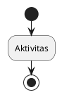

---

# 2. Struktur Dasar

## Simple Activity

Setiap aktivitas:

* Diawali `:`
* Diakhiri `;`

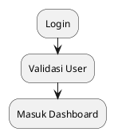

## Multi-line Activity

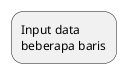

## List Activity

### Dash Style

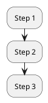

## Nested List

```plantuml
@startuml
* Modul User
** Register
** Login
*** Validasi Email
* Dashboard
@enduml
```

---

# 3. Start Stop End

## Start dan Stop

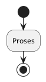

## End

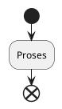

Perbedaan:

* `stop` = terminasi standard
* `end` = end state UML

---

# 4. Percabangan If Else

## Basic If

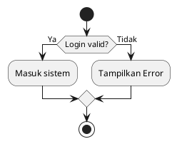

---

## Syntax Alternatif is

```plantuml
if (warna?) is (merah) then
:print merah;
else
:print lain;
endif
```

## Syntax equals

```plantuml
if (counter?) equals (5) then
:Print 5;
else
:Print lainnya;
endif
```

---

# 5. Multiple Condition (elseif)

## Horizontal Mode (default)

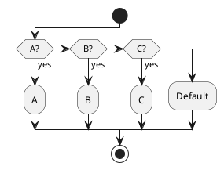

---

## Vertical Mode

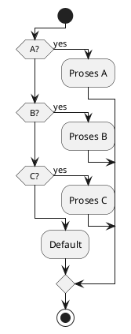

---

# 6. Switch Case

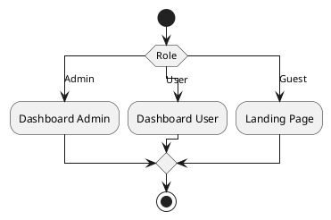

Cocok untuk:

* Role handling
* Status workflow
* Multiple state branch

---

# 7. Repeat Loop

## Basic Repeat

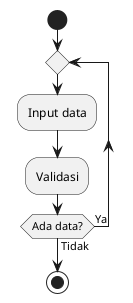

---

## Repeat dengan Backward

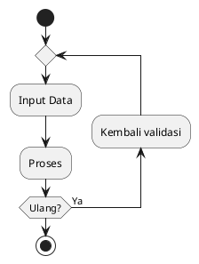

---

## Break dalam Repeat

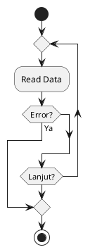

---

# 8. While Loop

## Basic While

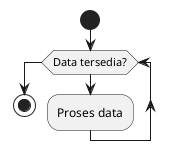

---

## While dengan label

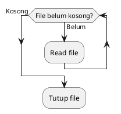

---

## While Backward

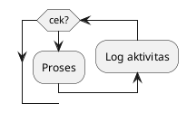

---

# 9. Parallel Processing (Fork)

## Basic Fork

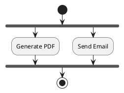

---

## End Merge

```plantuml
@startuml
start

fork
:Task A;

fork again
:Task B;

end merge

stop
@enduml
```

Perbedaan:

* `end fork` = sinkronisasi join
* `end merge` = merge flow

---

## Fork dengan Condition

```plantuml
@startuml
start

if (Multiprocessor?) then (Ya)

fork
:Thread 1;

fork again
:Thread 2;

end fork

else
:Sequential;
endif

stop
@enduml
```

---

# 10. Split Processing

Berbeda dengan fork.

```plantuml
@startuml
start

split
:A;

split again
:B;

split again
:C;

end split

:D;

stop
@enduml
```

---

# 11. Swimlane

## Basic Swimlane

```plantuml
@startuml

|User|
start
:Login;

|System|
:Validasi;

|User|
:Lihat Dashboard;

stop

@enduml
```

---

## Swimlane Warna

```plantuml
@startuml

|#pink|User|
:Request;

|#lightblue|Server|
:Process;

@enduml
```

---

## Swimlane dengan If

```plantuml
@startuml

|User|
start

if (Valid?) then
:Submit;
else
:Revisi;
endif

stop

@enduml
```

---

# 12. Partition / Grouping

```plantuml
@startuml

partition Authentication {
:Login;
:Validate;
}

partition Dashboard {
:Load Menu;
}

@enduml
```

Cocok untuk:

* Modul sistem
* Boundary proses
* Pengelompokan domain

---

# 13. Arrow

## Custom Arrow Label

```plantuml
@startuml
:Input;

-> Validasi data;

:Proses;
@enduml
```

---

## Warna Arrow

```plantuml
-[#blue]->
```

## Dashed Arrow

```plantuml
-[#green,dashed]->
```

## Dotted Arrow

```plantuml
-[#black,dotted]->
```

## Bold Arrow

```plantuml
-[#gray,bold]->
```

---

## Multiple Color Arrow

```plantuml
-[#red;#blue;#green]->
```

---

## Arrow Tanpa Head

```plantuml
@startuml
skinparam ArrowHeadColor none

start
:Step A;
:Step B;
stop

@enduml
```

---

# 14. Link

```plantuml
@startuml
:A;
link #blue
:B;
@enduml
```

---

# 15. Notes

## Right Note

```plantuml
note right
Validasi memakai JWT
end note
```

---

## Floating Note

```plantuml
@startuml
:Login;

note left
Catatan proses
end note

@enduml
```

---

# 16. Kill dan Detach

## Kill

Mengakhiri flow.

```plantuml
@startuml

if (Error?) then
:Error;
kill
endif

:Continue;

@enduml
```

---

## Detach

Melepas arrow.

```plantuml
@startuml

if (Timeout?) then
:Timeout;
detach
endif

@enduml
```

---

# 17. Label dan Goto

```plantuml
@startuml

start

if (A?) then
label target
:Shared Process;

else

goto target

endif

stop

@enduml
```

Eksperimental.

---

# 18. Connector

Circle connector:

```plantuml
@startuml

(A)
:Process;
(B)

@enduml
```

---

# 19. Condition Style

## Default

```plantuml
skinparam conditionStyle inside
```

---

## Diamond

```plantuml
skinparam conditionStyle diamond
```

---

## InsideDiamond

```plantuml
skinparam conditionStyle InsideDiamond
```

---

# 20. Condition End Style

## Diamond

```plantuml
skinparam ConditionEndStyle diamond
```

## Horizontal Line

```plantuml
skinparam ConditionEndStyle hline
```

---

# 21. Global Style

```plantuml
@startuml

<style>
activityDiagram {
 BackgroundColor #33668E
 BorderColor #33668E

 diamond {
   BackgroundColor #ccf
 }

 arrow {
   FontColor gold
 }

 partition {
   LineColor red
 }
}
</style>

start
:Init;
stop

@enduml
```

---

# 22. UML Shape Stereotype

## Object Node

```plantuml
:Data; <<object>>
```

## Signal

```plantuml
:Signal; <<objectSignal>>
```

## Accept Event

```plantuml
:Accept Event; <<acceptEvent>>
```

## Time Event

```plantuml
:Timer; <<timeEvent>>
```

## Send Signal

```plantuml
:Send Data; <<sendSignal>>
```

## Trigger

```plantuml
:Trigger; <<trigger>>
```

---

# 23. Coloring Activity

```plantuml
#pink:Error;
#palegreen:Success;
#lightblue:Process;
```

---

# 24. Complete Example Sistem Login

```plantuml
@startuml

|User|
start
:Input username/password;

|System|
:Validasi user;

if (Valid?) then (Ya)

fork
:Generate session;

fork again
:Log activity;

end fork

|User|
:Masuk Dashboard;

else (Tidak)
|User|
:Tampilkan error;
endif

stop

@enduml
```

---

# 25. Complete Example Approval Workflow

```plantuml
@startuml
start

:Submit Proposal;

switch (Level Approval)

case (Supervisor)
:Review Supervisor;

case (Manager)
:Review Manager;

case (Director)
:Review Director;

endswitch

if (Approved?) then

fork
:Generate Document;

fork again
:Send Notification;

end fork

else
:Revision;
endif

stop
@enduml
```

---

# 26. Best Practice

## Gunakan If untuk:

* Binary decision
* Validasi
* Approval

---

## Gunakan Switch untuk:

* Banyak state
* Banyak role
* Banyak status

---

## Gunakan Fork untuk:

* Async process
* Parallel task
* Background worker

---

## Gunakan Swimlane untuk:

* Actor vs system
* User vs admin
* Antar divisi

---

## Gunakan Partition untuk:

* Modular grouping
* Subsystem boundary

---

# 27. Cheat Sheet Singkat

| Syntax        | Fungsi          |
| ------------- | --------------- |
| start         | mulai           |
| stop          | selesai         |
| :Action;      | activity        |
| if/else/endif | branch          |
| elseif        | multi condition |
| switch/case   | state decision  |
| repeat        | loop            |
| while         | loop            |
| fork          | parallel        |
| split         | split flow      |
| detach        | remove flow     |
| kill          | terminate       |
| partition     | grouping        |
| |Actor|       | swimlane        |
| note          | note            |
| label/goto    | jump            |

---

# 28. Template Boilerplate

```plantuml
@startuml

start

:Step 1;

if (Condition?) then (Yes)
:Action A;
else
:Action B;
endif

fork
:Parallel 1;

fork again
:Parallel 2;

end fork

stop

@enduml
```

---

# 29. Kapan Pakai Activity Diagram Beta vs BPMN

## Pakai Activity Diagram Beta jika:

* Dokumentasi sistem
* Use case flow
* Logic aplikasi
* Sequence proses sederhana

## Pakai BPMN jika:

* Event boundary kompleks
* Message flow antar organisasi
* SLA process
* Orkestrasi bisnis formal

---

# 30. Referensi Resmi

* PlantUML Activity Diagram Beta
* PlantUML Styling
* PlantUML Stereotypes
* PlantUML Swimlanes

Sumber resmi: [https://plantuml.com/activity-diagram-beta](https://plantuml.com/activity-diagram-beta) ([plantuml.com](https://plantuml.com/activity-diagram-beta?utm_source=chatgpt.com))
