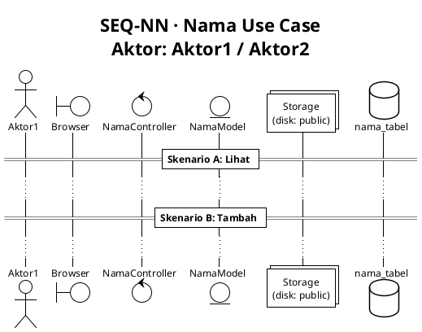

# Rules & Konvensi Pembuatan Diagram SiLab

> Berlaku untuk **seluruh modul** — Inventaris, Praktikum, Keuangan, Kegiatan, Piket, Surat, Sertifikat, Kuesioner, dll.  
> Dokumen ini menjadi acuan sebelum membuat atau memperbarui diagram.

---

## 1. Struktur Folder

```
docs/
├── rules.md                   ← Dokumen ini
├── {modul}/
│   ├── README.md              ← Index modul (tabel UC, sequence, hak akses)
│   ├── usecase/
│   │   └── UC_{MODUL}.puml   ← Satu file use case per modul
│   └── sequence/
│       ├── SEQ_01_*.puml
│       ├── SEQ_02_*.puml
│       └── ...
```

Nama folder modul menggunakan **huruf kecil** tanpa spasi: `inventaris`, `praktikum`, `keuangan`, `kegiatan`, `piket`, `surat`, `sertifikat`, `kuesioner`, `data_master`, dst.

---

## 2. Konvensi Use Case

### 2a. Prinsip "Mengelola vs Melihat"

| Kondisi                                                              | Use Case      | Contoh                   |
| -------------------------------------------------------------------- | ------------- | ------------------------ |
| Aktor punya akses **CRUD** (create/edit/delete) pada entitas         | `Mengelola X` | Mengelola Praktikum      |
| Aktor hanya punya akses **VIEW** (tanpa CRUD) pada entitas yang sama | `Melihat X`   | Melihat Daftar Praktikum |

**Aturan:**

- Jika di satu modul ada aktor A yang bisa CRUD dan aktor B yang hanya bisa view → buat **dua** use case: `Mengelola X` (untuk A) dan `Melihat X` (untuk B).
- Jika semua aktor hanya bisa view (tidak ada yang bisa CRUD) → satu use case `Melihat X`.
- Use case `Mengelola X` **sudah mencakup view** secara implisit, tidak perlu use case view terpisah untuk aktor yang punya CRUD.

### 2b. Penamaan Use Case

```
Mengelola {Entitas}             → CRUD penuh
Melihat {Entitas/Daftar}        → View only (tidak ada create/edit/delete)
Mengajukan {Aksi}               → Aksi inisiatif dari aktor bawah (submit, request)
Menyetujui / Menolak {Entitas}  → Aksi approval
Mengumpulkan {Entitas}          → Submit (aksi aktif tapi bukan CRUD admin)
Mengakses {Entitas}             → View + download (bukan edit)
Mengelola {Entitas} (CRUD + {detail aksi tertentu}) → jika ada sub-aksi penting
```

### 2c. Aktor yang Digunakan

| Peran Sistem              | Label di Diagram | Catatan                                                                              |
| ------------------------- | ---------------- | ------------------------------------------------------------------------------------ |
| Admin / Ketua Lab / Kalab | `Admin`          | Kepengurusan aktif, punya create/delete rights                                       |
| Asisten / Aslab           | `Asisten`        | Kepengurusan aktif, manage konten tapi tidak selalu bisa create/delete entitas utama |
| Kepala Departemen         | `Kadep`          | Akses approval, data master, read-only laporan                                       |
| Praktikan (mahasiswa)     | `Praktikan`      | Role khusus mahasiswa, submit-only                                                   |
| Pengguna tanpa login      | `Publik`         | Akses via QR/link publik, no auth                                                    |

> ⛔ **Superadmin TIDAK dimasukkan** dalam diagram use case maupun sequence.

### 2d. Relasi Use Case Opsional

Gunakan hanya jika benar-benar dipakai di sistem:

- `<<include>>` — use case A selalu memanggil B
- `<<extend>>` — use case B opsional memperluas A
- Generalisasi aktor: `Aktor B --|> Aktor A` jika B mewarisi semua akses A

---

## 3. Konvensi Sequence Diagram

### 3a. Satu Sequence per Use Case

Setiap use case di diagram UC → satu file `.puml` sequence.

**Rasio:**
| UC | Sequence |
|----|----------|
| Mengelola Praktikum | SEQ_01_MENGELOLA_PRAKTIKUM.puml |
| Melihat Daftar Praktikum | SEQ_02_MELIHAT_PRAKTIKUM.puml |
| Mengelola Modul | SEQ_03_MENGELOLA_MODUL.puml |

### 3b. Isi Sequence untuk "Mengelola X"

Sequence untuk `Mengelola X` **wajib mencakup semua skenario CRUD** dalam satu file menggunakan `== Skenario A/B/C/D ==`:

```
== Skenario A: Lihat Daftar ==
... flow GET /endpoint ...

== Skenario B: Tambah Baru ==
... flow POST /endpoint ...

== Skenario C: Edit ==
... flow PUT /endpoint/{id} ...

== Skenario D: Hapus ==
... flow DELETE /endpoint/{id} ...
```

Sub-aksi tambahan (bulk delete, export, regenerate, dll.) ditambahkan sebagai skenario E, F, dst.

### 3c. Isi Sequence untuk "Melihat X"

Sequence untuk `Melihat X` hanya berisi skenario **tampil daftar** dan **tampil detail** (jika ada):

```
== Lihat Daftar ==
...

== Lihat Detail ==
...
```

### 3d. Tipe Participant PlantUML

Gunakan keyword PlantUML yang tepat sesuai peran peserta dalam sequence:

| Tipe PlantUML | Digunakan untuk                                                                      | Contoh                                             |
| ------------- | ------------------------------------------------------------------------------------ | -------------------------------------------------- |
| `actor`       | Aktor manusia                                                                        | `actor "Admin" as Admin`                           |
| `boundary`    | Lapisan UI / browser                                                                 | `boundary "Browser" as Browser`                    |
| `control`     | Controller Laravel                                                                   | `control "PraktikumController" as Controller`      |
| `entity`      | Eloquent Model (entitas data)                                                        | `entity "Praktikum Model" as Model`                |
| `collections` | File storage / disk                                                                  | `collections "Storage\n(disk: public)" as Storage` |
| `database`    | Tabel database — **diberi nama tabel utama** yang dioperasikan, **bukan** "Database" | `database "praktikum" as DB`                       |

> **Aturan database:** label `database` menggunakan **nama tabel utama** (snake_case) sesuai tabel yang paling banyak dioperasikan dalam sequence tersebut. Jika sequence melibatkan banyak tabel yang sejajar pentingnya, gunakan nama tabel primer (tabel tempat CREATE/UPDATE/DELETE).

### 3e. Format Standar File Sequence



### 3f. Komponen yang Wajib Tampil di Sequence

- **Middleware** yang relevan (auth, role, policy) dicantumkan di pesan request pertama, contoh: `[auth:sanctum + role:asisten]`
- **Validasi** dicantumkan sebagai note atau blok `alt Validasi Gagal / else Sukses`
- **Storage / File** ditampilkan sebagai participant terpisah jika ada upload/download
- **Nama route** dicantumkan di arrow request: `POST /endpoint`
- **Query SQL** deskriptif (tidak harus persis SQL, tapi cukup jelas)

---

## 4. Konvensi File PlantUML

### 4a. Penamaan File

```
UC_{MODUL}.puml                         ← use case
SEQ_{NN}_{NAMA_USECASE_UPPERCASE}.puml  ← sequence, NN = 2-digit number
```

### 4b. Theme & Skinparam

Semua file menggunakan:

```
!theme plain
skinparam defaultFontSize 12
```

---

## 5. Modul yang Sudah Dibuat

| Modul             | Usecase                            | Sequence        | Status  |
| ----------------- | ---------------------------------- | --------------- | ------- |
| Inventaris        | ✅ `docs/inventaris/usecase/`      | ✅ 18 sequences | Selesai |
| Praktikum         | ✅ `docs/praktikum/usecase/`       | ✅ 16 sequences | Selesai |
| Keuangan          | ✅ `docs/keuangan/usecase/`        | ✅ 4 sequences  | Selesai |
| Piket             | ✅ `docs/piket/usecase/`           | ✅ 6 sequences  | Selesai |
| Kegiatan & Proker | ✅ `docs/kegiatan_proker/usecase/` | ✅ 13 sequences | Selesai |
| Surat             | ✅ `docs/surat/usecase/`           | ✅ 2 sequences  | Selesai |
| Sertifikat        | —                                  | —               | Belum   |
| Kuesioner         | ✅ `docs/kuesioner/usecase/`       | ✅ 3 sequences  | Selesai |
| Data Master       | —                                  | —               | Belum   |
| Kepengurusan      | —                                  | —               | Belum   |

---

## 6. Checklist Sebelum Commit Diagram

- [ ] Tidak ada aktor `superadmin` dalam diagram
- [ ] Setiap UC yang "Mengelola" punya sequence dengan minimal skenario A/B/C/D
- [ ] Setiap UC yang "Melihat" (view-only) punya sequence terpisah
- [ ] Nama file sesuai konvensi (`SEQ_NN_*.puml`)
- [ ] Tidak ada duplikat nomor sequence dalam satu modul
- [ ] README.md modul sudah diperbarui dengan tabel terbaru
